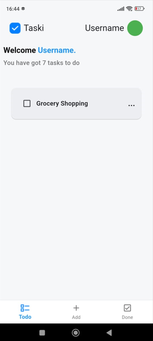
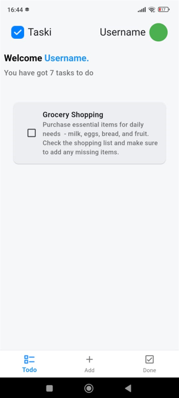
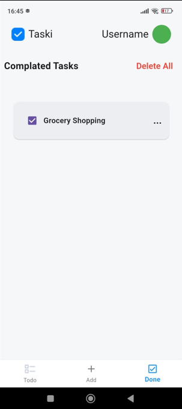
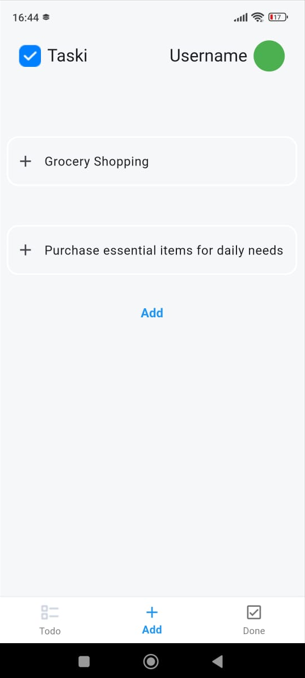

Flutter and Isar-powered ToDo App
An elegant ToDo app built with Flutter and Isar database.

Features
Add, edit, and delete tasks
Secure and fast data storage with Isar
User-friendly interface
Cross-platform support using Flutter (iOS and Android)
Quick and simple setup

Technologies
Flutter
Isar (NoSQL database)